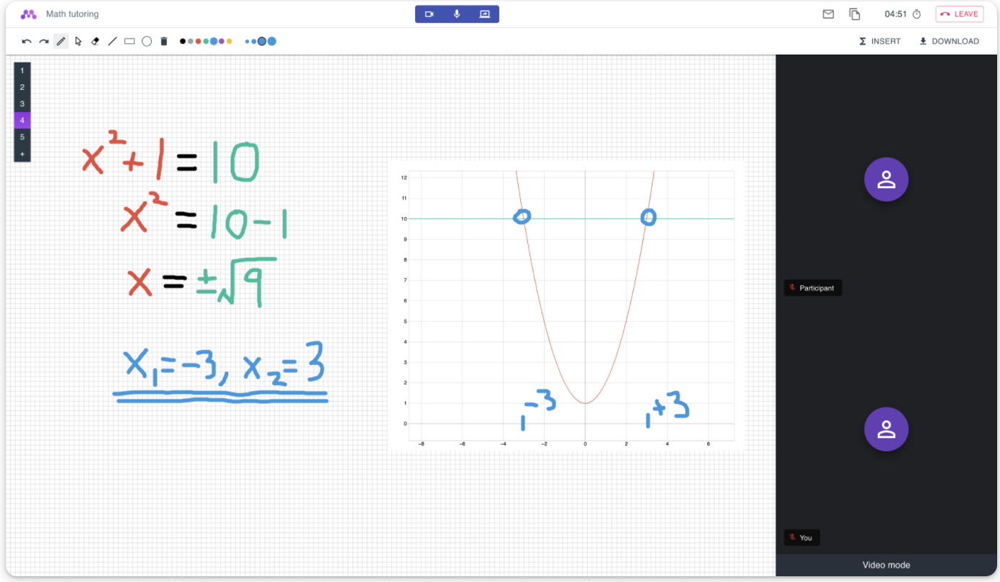

<div align="center">

</div>

## Overview

`Nettu Meet` is an open source video conference web application designed for interactive online tutoring. Some of the features included are:

- **Audio and video**: Real-time sharing of audio and video.
- **Shared whiteboard**: Collaborate with students on a shared whiteboard.
- **Screen sharing**: Go to presenting mode by sharing your screen.
- **Chat**: Send simple messages to other participants of the meeting.
- **File sharing**: Upload relevant files to the meeting.
- **Graph plotter**: Insert mathematical graphs to the whiteboard.
- **Customizable**: Create an account and upload your own logos. 

<br />
<div align="center">

</div>
<br />


<br/>

## Live demo

[Live demo](https://meet.nettubooking.com) 

## Run it locally
* Run the Node.js server application in a terminal:

```bash
$ cd server
# Copy .env.template secrets file and adjust them if needed
$ cp integrations/.env.template integrations/.env
# Using docker compose to spin up redis and mongodb 
$ npm run infra
# Installing server dependencies
$ npm i
# Starting server
$ npm start
```


* In a different terminal run the browser application:

```bash
$ cd frontend
$ npm i
$ npm start
```

* Create meeting
```bash
# The response will give you a entrypoint / url for your meeting.
$ curl -X POST "http://localhost:5000/api/v1/meeting" -H  "authorization: nettu_meet_default_secret" -H  "Content-Type: application/json" -d "{  \"title\": \"First Nettu Meet meeting\"}"
```


## Documentation

The server exposes a swagger document at http://localhost:5000/api/v1/docs/. Or you can check it out live [here](https://api.meet.nettubooking.com/api/v1/docs)


## Contributing

Contributions are welcome and greatly appreciated!

## License

[AGPL3](LICENSE) 
